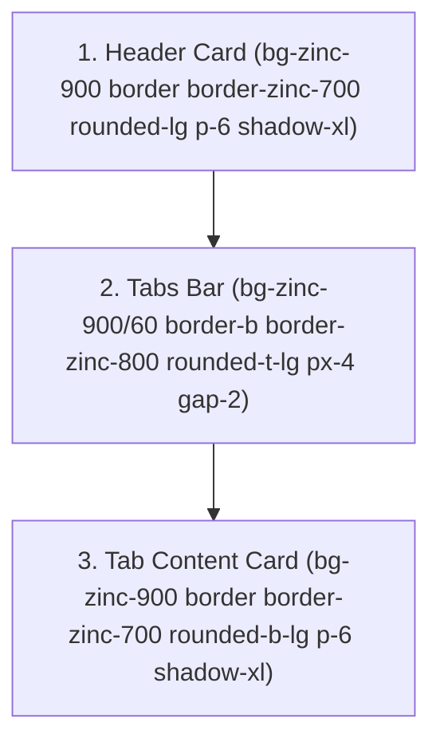

# Directiva de Estilos y Diseño de UI (PZ-Panel)

Para mantener una experiencia de usuario (UX/UI) coherente, profesional y predecible en todo el panel, **todas las vistas con pestañas, formularios o tarjetas deben implementar estrictamente este patrón de diseño**.

---

## 1. Estructura General de una Vista con Pestañas

Una pantalla tabulada se compone de 3 bloques principales:
1. **Header Card:** Tarjeta superior independiente con título, icono, descripción y controles globales (búsqueda, refresco, botones primarios).
2. **Tabs Bar:** Barra de pestañas con borde inferior, bordes superiores redondeados (`rounded-t-lg`), fondo semitransparente y sincronización con URL (`?tab=...`).
3. **Tab Content Card:** Tarjeta inferior con bordes inferiores redondeados (`rounded-b-lg`) que encapsula el contenido de la pestaña activa.



---

## 2. Especificación de Clases CSS (Tailwind)

### A. Header Card
```tsx
<div className="bg-zinc-900 border border-zinc-700 rounded-lg p-6 shadow-xl flex flex-col md:flex-row md:items-center justify-between gap-4">
  <div>
    <h3 className="text-xl font-bold text-white flex items-center space-x-2">
      <Icon className="w-6 h-6 text-indigo-400" />
      <span>{Title}</span>
    </h3>
    <p className="text-xs text-zinc-400 mt-1">{Subtitle / Description}</p>
  </div>
  {/* Acciones del header: Search bar, Refresh button, Action buttons */}
</div>
```

### B. Barra de Pestañas (Tabs Bar)
- **Contenedor:**
  ```tsx
  <div className="flex overflow-x-auto border-b border-zinc-800 bg-zinc-900/60 rounded-t-lg px-4 gap-2">
  ```
- **Botón de Pestaña (Tab Button):**
  ```tsx
  <button
    onClick={() => handleTabChange('tab_key')}
    className={`flex items-center space-x-2 px-4 py-3 text-sm font-medium border-b-2 transition-colors cursor-pointer ${
      activeTab === 'tab_key'
        ? 'border-indigo-500 text-indigo-400'
        : 'border-transparent text-zinc-400 hover:text-zinc-200'
    }`}
    aria-label="Nombre de Pestaña"
  >
    <Icon className="w-4 h-4" />
    <span>{Label}</span>
    
    {/* Badge numérico opcional */}
    {count !== undefined && (
      <span className="px-1.5 py-0.2 text-[10px] bg-zinc-800 text-zinc-300 rounded-full border border-zinc-700">
        {count}
      </span>
    )}
  </button>
  ```

### C. Tarjeta de Contenido (Tab Content Card)
```tsx
<div className="bg-zinc-900 border border-zinc-700 rounded-b-lg p-6 shadow-xl space-y-6">
  {/* Contenido de la pestaña */}
</div>
```

---

## 3. Sincronización Mandatoria con URL (`?tab=...`)

Toda vista tabulada debe utilizar estado derivado directamente de la URL para garantizar persistencia tras recargar (F5) y permitir enlaces compartibles:

```tsx
import { useSearchParams, useRouter, usePathname } from 'next/navigation';

const VALID_TABS = ['tab1', 'tab2', 'tab3'] as const;
type TabType = typeof VALID_TABS[number];

export default function MyClientComponent() {
  const searchParams = useSearchParams();
  const router = useRouter();
  const pathname = usePathname();

  const tabParam = searchParams.get('tab') as TabType | null;
  const activeTab: TabType = tabParam && VALID_TABS.includes(tabParam) ? tabParam : 'tab1';

  const handleTabChange = (tab: TabType) => {
    const params = new URLSearchParams(searchParams.toString());
    params.set('tab', tab);
    router.replace(`${pathname}?${params.toString()}`, { scroll: false });
  };
```

---

## 4. Estilos de Badges y Estados

- **Activo / Online / Éxito:**
  `bg-emerald-950/70 text-emerald-300 border border-emerald-800`
- **Advertencia / Booting / Importante:**
  `bg-amber-950/70 text-amber-300 border border-amber-800`
- **Inactivo / Offline / Peligro / Baneo:**
  `bg-rose-950/70 text-rose-300 border border-rose-800`
- **Neutral / Contador / Secundario:**
  `bg-zinc-800 text-zinc-300 border border-zinc-700`
- **Info / Logs / Historial:**
  `bg-sky-950/70 text-sky-300 border border-sky-800`

---

## 5. Código de Colores Semánticos para Iconos de Pestañas

Los iconos de las pestañas deben incorporar un color temático y semántico acorde a su función:

| Módulo / Pestaña | Icono | Clase de Color | Significado Semántico |
|---|---|---|---|
| **Players: Live** | `Radio` | `text-emerald-400 animate-pulse` | Conectados en vivo / En línea |
| **Players: History** | `History` | `text-sky-400` | Registro cronológico / Logs |
| **Players: Whitelist** | `ShieldCheck` | `text-indigo-400` | Seguridad / Acceso permitido |
| **Players: Bans** | `Ban` | `text-rose-400` | Moderación punitiva / Bloqueos |
| **Players: Broadcast** | `Megaphone` | `text-amber-400` | Anuncios / Difusión global |
| **Settings: Properties** | `Sliders` | `text-cyan-400` | Configuración del motor .ini |
| **Settings: Spawns** | `MapPin` | `text-emerald-400` | Puntos de aparición en el mapa |
| **Sandbox: Zombies** | `Skull` | `text-rose-400` | Amenaza zombi / Mortalidad |
| **Sandbox: Loot** | `Package` | `text-amber-400` | Cajas / Suministros / Botín |
| **Sandbox: World** | `Sun` | `text-sky-400` | Clima / Tiempo / Naturaleza |
| **Sandbox: Vehicles** | `Car` | `text-blue-400` | Vehículos / Motores / Gasolina |
| **Sandbox: Character** | `UserCheck` | `text-emerald-400` | Sobreviviente / Habilidades / Salud |
| **Sandbox: Advanced** | `Wrench` | `text-purple-400` | Ajustes técnicos / Mecánicas |
| **Sandbox: Mods** | `Sliders` | `text-teal-400` | Opciones de extensiones y mods |

